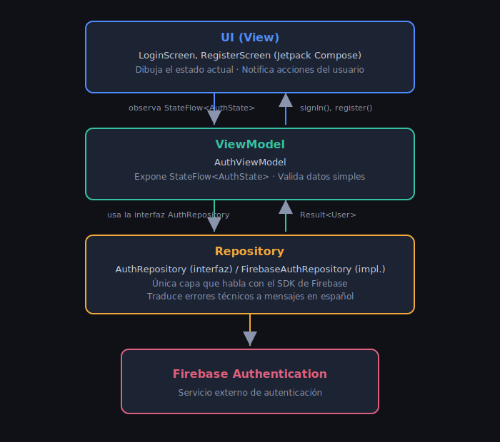

# ARQUITECTURA MVVM

Este proyecto sigue el patrón MVVM (Model - View - ViewModel), con una capa adicional de Repository que actúa como puente entre el ViewModel y Firebase.

## DIAGRAMA DE CAPAS

RESPONSABILIDADES DE CADA CAPA

Model: contiene las clases de datos puras, sin lógica:

* User: representa a un usuario autenticado en la app (independiente de Firebase).

* AuthState: sealed class que representa el estado de la pantalla de autenticación (Idle, Loading, Success, Error).

REPOSITORY

* AuthRepository (interfaz): define qué operaciones de autenticación existen, sin especificar cómo se implementan.

* FirebaseAuthRepository (implementación): es la única clase del proyecto que importa clases del SDK de Firebase. Traduce entre FirebaseUser (modelo de Firebase) y User (modelo propio de la app), y traduce las excepciones técnicas de Firebase a mensajes en español.

VIEWMODEL

* AuthViewModel: expone un único StateFlow<AuthState> que las pantallas observan. Valida datos simples (campos vacíos, longitud de contraseña) antes de llamar al repositorio, y no tiene ninguna dependencia de Jetpack Compose.

View (UI)

* LoginScreen, RegisterScreen: son funciones @Composable que solo se encargan de dibujar la UI según el estado recibido, y de notificar acciones del usuario. No contienen lógica de negocio.

## ¿POR QUÉ SEPARAR: REPOSITORY DE VIEWMODEL?

El AuthViewModel depende únicamente de la interfaz AuthRepository, nunca de FirebaseAuthRepository directamente. Esto permite:

* Sustituir la implementación real por una falsa (FakeAuthRepository) en pruebas unitarias, sin necesidad de conectarse a Firebase de verdad.

* Cambiar de proveedor de autenticación en el futuro sin modificar el ViewModel ni las pantallas.